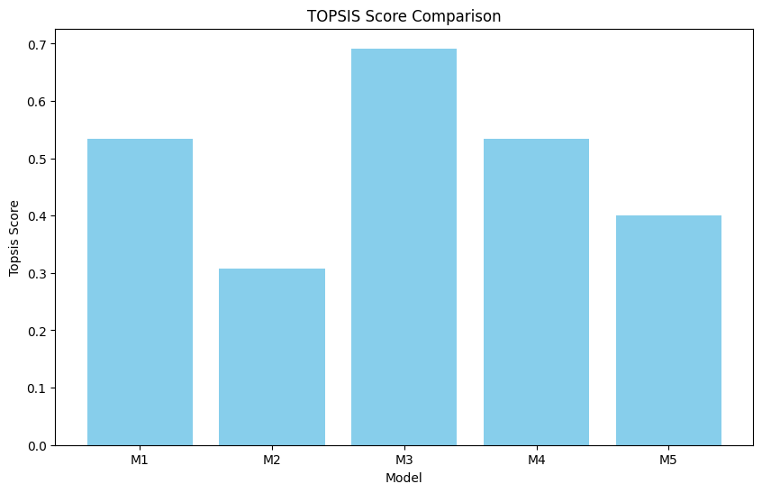

# Topsis-Gurdarshan-102303217

`Topsis-Gurdarshan-102303217` is a Python library for solving **Multiple Criteria Decision Making (MCDM)** problems using the **Technique for Order of Preference by Similarity to Ideal Solution (TOPSIS)**.

## Methodology

TOPSIS is based on the concept that the chosen alternative should have the shortest geometric distance from the positive ideal solution (best possible value) and the longest geometric distance from the negative ideal solution (worst possible value).

### Step-by-Step Implementation:

1.  **Normalization**: 
    The decision matrix is normalized to scale all criteria to a common range (0 to 1). The formula used is vector normalization:
    $$r_{ij} = \frac{x_{ij}}{\sqrt{\sum_{i=1}^{m} x_{ij}^2}}$$

2.  **Weighting**: 
    The normalized matrix is multiplied by the weights provided for each criterion.
    $$v_{ij} = r_{ij} \times w_j$$

3.  **Ideal Best & Ideal Worst**: 
    We identify the ideal best ($V^+$) and ideal worst ($V^-$) values.
    * **Beneficial Criteria (+):** Max value is best, Min value is worst.
    * **Non-Beneficial Criteria (-):** Min value is best, Max value is worst.

4.  **Euclidean Distance**: 
    Calculate the distance of each alternative from the Ideal Best ($S_i^+$) and Ideal Worst ($S_i^-$):
    $$S_i^+ = \sqrt{\sum (v_{ij} - V_j^+)^2}$$
    $$S_i^- = \sqrt{\sum (v_{ij} - V_j^-)^2}$$

5.  **Performance Score**: 
    The final TOPSIS score is calculated as:
    $$P_i = \frac{S_i^-}{S_i^+ + S_i^-}$$


## Installation

```bash
pip install Topsis-Gurdarshan-102303217

```

## Usage

Run the package via command line as follows:

```bash
topsis <InputDataFile> <Weights> <Impacts> <ResultFileName>

```

### Example

**Command:**

```bash
topsis data.csv "0.25,0.25,0.25,0.25" "+,+,-,+" result.csv

```

**Input Data (data.csv):**

| Model | Storage | Camera | Price | Looks |
| --- | --- | --- | --- | --- |
| M1 | 16 | 12 | 250 | 5 |
| M2 | 16 | 8 | 200 | 3 |
| M3 | 32 | 16 | 300 | 4 |
| M4 | 32 | 8 | 275 | 4 |
| M5 | 16 | 16 | 225 | 2 |

**Output Result (result.csv):**

| Model | Storage | Camera | Price | Looks | Topsis Score | Rank |
| --- | --- | --- | --- | --- | --- | --- |
| M1 | 16 | 12 | 250 | 5 | 0.534277 | 3 |
| M2 | 16 | 8 | 200 | 3 | 0.308368 | 5 |
| M3 | 32 | 16 | 300 | 4 | 0.691632 | 1 |
| M4 | 32 | 8 | 275 | 4 | 0.534737 | 2 |
| M5 | 16 | 16 | 225 | 2 | 0.401046 | 4 |

---

## Result Analysis

Based on the TOPSIS scores obtained:

* **Model M3** achieves the highest score (~0.69), making it the **Rank 1** choice. It balances high specifications with a reasonable price.
* **Model M2** receives the lowest score (~0.30), placing it at **Rank 5**, primarily due to lower specifications despite the lower price.

The graph below (generated in the accompanying Colab notebook) visualizes the performance scores:

* X-Axis: Alternatives (M1, M2, etc.)
* Y-Axis: TOPSIS Score
* The bar chart clearly indicates M3 as the superior option.

```


```

## License

[MIT](https://choosealicense.com/licenses/mit/)

